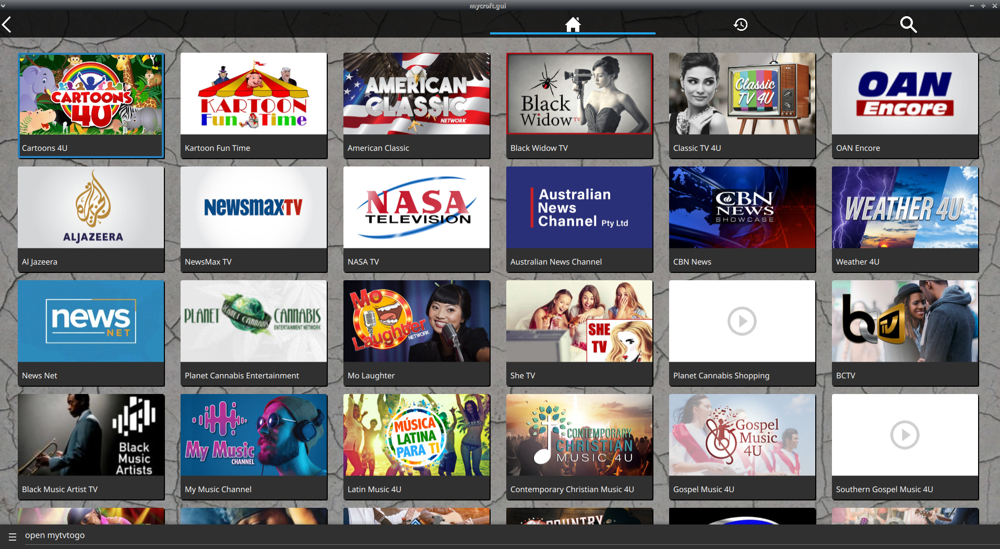

#  MyTVtoGo Skill

## About 

MyTVtoGo for mycroft

## Installation Notes

this requires [skill-better-playback-control](https://github.com/JarbasSkills/skill-better-playback-control), it will blacklist and replace the official mycroft skill

## Examples 

* "open mytvtogo"
* "play tv"
* "play nasa tv"
* "play music tv"
* "play my tv to go news"

## Credits 
- JarbasAl
- [AIIX ](https://github.com/AIIX/) - for GUI
- [MyTVtoGo](https://mytvtogo.net/) 

## Category
**Entertainment**

## Tags
#iptv
#video
#entertainment